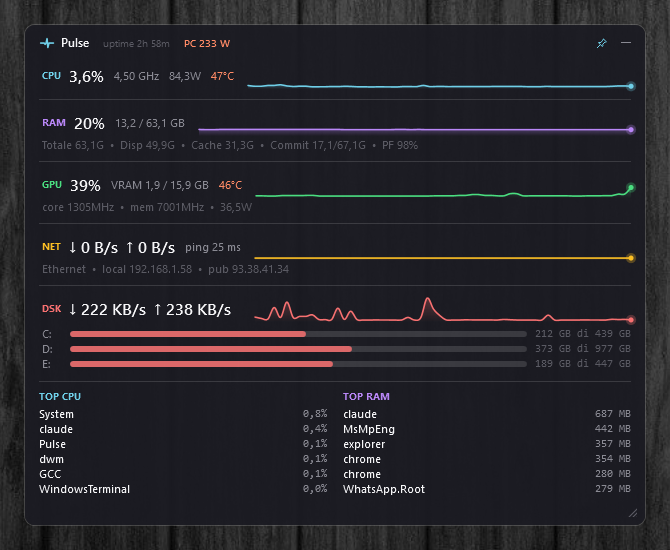

# Pulse

A lightweight, always-on Windows widget that shows live system metrics — CPU, RAM, GPU, network, disk, top processes — without the bloat of Task Manager.



## Why

Task Manager works but it's too big, doesn't remember its size/position, and you have to launch it manually every time. Pulse is a 600×500 always-on-top widget that:

- Starts automatically with Windows (optional)
- Remembers position and size between sessions
- Lives in the system tray (one click to hide/show)
- Shows live sparklines for the last 60 seconds
- Uses ~150 MB RAM and ~1-2% CPU idle

## Features

- **CPU**: usage %, current clock (GHz), temperature, power (W)
- **RAM**: usage %, used/total GB, cached, committed, page file %
- **GPU**: usage %, VRAM used/total, temperature, core/memory clocks, power (W)
- **Network**: ↓/↑ throughput, Wi-Fi SSID/signal, local IP, public IP, ping to 8.8.8.8
- **Disk**: total ↓/↑ throughput, per-drive free space + bar, SSD temp
- **Top processes**: top 6 by CPU and by RAM, updated every 5s
- **System**: uptime, estimated total PC power draw (W)

## Install

### Option A — Installer (recommended)

Download the latest `Setup-Pulse-vX.Y.Z.exe` from the [Releases page](../../releases). The installer offers:

- ☑ Start with Windows (login)
- ☑ Start with administrator privileges (enables CPU temperature/power reading on supported hardware)
- ☑ Desktop shortcut

The "admin via Scheduled Task" option creates a Windows scheduled task that runs Pulse on logon with elevated privileges, so you don't get a UAC prompt every boot.

### Option B — Portable build

Grab `Pulse-vX.Y.Z-portable.zip` from Releases, extract anywhere, and run `Pulse.exe`. Settings are stored in `%APPDATA%\Pulse\settings.json`.

## Hardware requirements

- Windows 10 / 11 (x64)
- .NET 9 Desktop Runtime ([download](https://dotnet.microsoft.com/download/dotnet/9.0))

To read CPU temperature and power, Pulse needs Ring-0 access via a signed kernel driver:

| System | What you need | Works under VBS / HVCI |
|---|---|---|
| AMD Ryzen | Install [AMD Ryzen Master](https://www.amd.com/en/products/processors/ryzen-master.html) → its driver stays loaded as a service | ✅ Yes |
| Intel Core (Gen 8-13+) | LHM driver loads OK if VBS is off, otherwise install [HWiNFO64](https://www.hwinfo.com) | Partial (VBS may block) |
| No supported tool installed | CPU temp/power show as `n/a`, everything else still works | ✅ |

See [docs/HARDWARE-SUPPORT.md](docs/HARDWARE-SUPPORT.md) for details on each CPU family.

## Tray menu

Right-click the tray icon (near the clock) for:

- Show / Hide — toggle widget visibility
- Always on top — pin toggle
- Start with Windows — autostart (regular user privileges)
- Restart as administrator — re-launch elevated (enables MSR sensors)
- Exit

## Build from source

See [docs/BUILD.md](docs/BUILD.md) for full instructions. TL;DR:

```bash
git clone https://github.com/caste9612/Pulse
cd Pulse/ResourceMonitor
dotnet publish -c Release -r win-x64 --self-contained false -p:PublishSingleFile=true -o ../dist
```

Output: `dist/Pulse.exe` (~7 MB, with ReadyToRun precompiled).

## Architecture

Briefly: WPF UI on top of background services polling at staggered intervals. See [docs/ARCHITECTURE.md](docs/ARCHITECTURE.md).

```
MainWindow (WPF, transparent borderless)
   │
   ├── MetricsService    (1s tick: CPU/RAM/Disk/Net via PerformanceCounter)
   ├── HardwareMonitor   (2s tick: LibreHardwareMonitorLib — temps, clocks, watts)
   ├── ProcessMonitor    (5s tick: top processes via Process.GetProcesses)
   ├── NetworkMonitor    (2s tick: ping, IPs, SSID via netsh)
   └── DriveMonitor      (30s tick: DriveInfo.GetDrives)
```

## License

MIT. See [LICENSE](LICENSE).

Bundles LibreHardwareMonitorLib (MPL 2.0).
